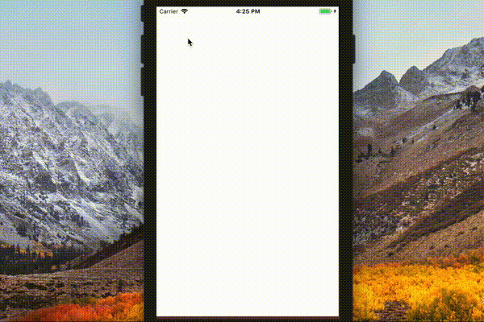
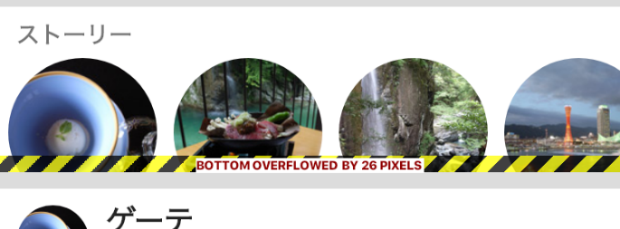
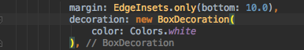

# flutterでFacebookっぽいアプリを作った時の記事

# はじめに
先日、セミナーで登壇する資料を作成している時に、ちょっとFlutterに触れる機会があり
思いの外良い感じで動いてくれたので、もうちょっと触ってみるかということで
Facebookアプリっぽい感じのUIを作った。
だいたい、4時間くらいかかりました。
（いやいや、Reactで作れっつー話ですが、そこはまぁ。。）

# 出来たもの

## iOS


## Android


## 動いているところ




# 環境
macOS High Sierra
Android Studio 3.1.4
Flutter SDKのインストール方法は[こちら](https://flutter.io/setup-macos/)を参照。
※```$ flutter doctor```コマンドまでたどり着けば、あとは指示通りに対応していくだけですね。


# ソース寄越せ
動かしてみたい方は[こちらのGithub](https://github.com/TakeEndo/flutter_test)から試せます。

cloneしたくないよ、という方は、下記の手順でどうぞ。

1.　[File]→[Create New Flutter Application]→[Flutter Application]で新しいアプリを作成する。
2. lib以下に、main.dartが自動生成されているので、その中身を[これ](https://github.com/TakeEndo/flutter_test/blob/master/lib/main.dart)で上書きする。
3. libと同じ階層にimagesディレクトリを用意
4. 上記Githubから画像をダウンロードして、imagesに入れる
5. pubspec.yamlに使用するアセットを[記載する](https://github.com/TakeEndo/flutter_test/blob/master/pubspec.yaml)

```pubspec.yaml
  assets:
    - images/back.jpeg
    - images/0.jpg
    - images/1.jpg
    - images/2.jpg
    - images/3.jpg
```

※リファクタリングとか一切していないので、参考程度に考えてください。。

# 諦めた点

## TabBarの背景色
TabBarの背景を白くできなかった。
PrimaryColorを変えると良いよ、とかTabBarをContainerでWrapすると良いとかあったのですが
SliverAppBarとの組み合わせだとうまいこと出来なかった。

## TabIconのデザイン
Tabには、Iconという標準で用意されているパーツを採用しため、本家とは見た目がかなり変わってしまった。
Imageを使って実装すれば、Facebookな感じにもなると思うのですが戦略的に撤退しました。

## ハードウェア機能との連動
カメラとか、その辺はやってません。
[ドキュメント](https://pub.dartlang.org/packages/camera)見たら、なんかめんどくさそうだったので、今回はやめました。

## DBアクセス
表示しているデータを[SQLite](https://pub.dartlang.org/packages/sqflite)とか使って読み込みしたら、もうちょっとマシなサンプルになったと思っています。

## その他細かいデザイン
すみません、色々と妥協しています。。。

## 蛇足
### floatingActionButton
floatingActionButtonも標準で出来るので簡単だよ、ということを伝えたかった。
Twitterっぽい感じ。

### Drawer
カメラボタン押すと、なんとDrawerが出てくる。
これも簡単だよ、ということを伝えるための蛇足。

# Flutterの良かった点
## 標準のパーツが豊富
余計な（余計ではないか）モジュールをインストールしなくても
標準のパーツだけで、ある程度かっこいいアプリが作れちゃう点。

Reactとかだと、npmでアレ入れて、コレ入れて、とか必要になって
途中でエラー出てムキーってなるのが目に見えてる。
ネイティブでも、TableViewとかCollectionViewとか地味に面倒で。
その分カスタマイズが出来るのは分かりますが。。

今回のUIに関しては、何も追加せずに実装できました。
スクロールに合わせて、ヘッダが見え隠れするとか、ネイティブで実装しようと思ったら、そこそこ面倒ですよね？

## hot reloadが早い
あれ、これWeb開発か？って思うくらい早い。
Android Studioから、iOSのシミュレータをhot reloadできるのも感動する。

## 色々親切
### はみ出した時の図

よくみると、26px足んねーぞって言ってる。
なにこれすごい。

### 閉じ括弧の最後に、自動でコメントつけてくれる



Widgetsがすぐ、ごちゃごちゃ〜ってなるので、ちょっと嬉しい。
ちょっと鬱陶しい時もある。
どちらかというと、これはAndroid Studioの機能？

# 気になる点
## 階層が深くなりがち
レイアウトにこだわると、一旦、Containerに入れて、Marginとって、影つけて、Stackに入れて、Flexに入れて、、、
となっていくので、油断していると結構階層が深くなる気がする。
ちゃんとルール決めるとか、うまいことClass化するとか、工夫がいるかも？

## まだまだマイナー？
あんまり日本語の情報が見つからない。
もっと流行ってほしい。

# 謝辞
開発中のテスト画像に、一部Ricoh様のサンプル画像を利用しています。
http://www.ricoh-imaging.co.jp/japan/dc/gr/digital/sample.html

# 余談
あと、Flutter全然関係ないんですが、名作文学がこんな感じでさらっと読めるアプリ良いかも。
自分で作ってて、「あ、私、天才だな。」と思った。

